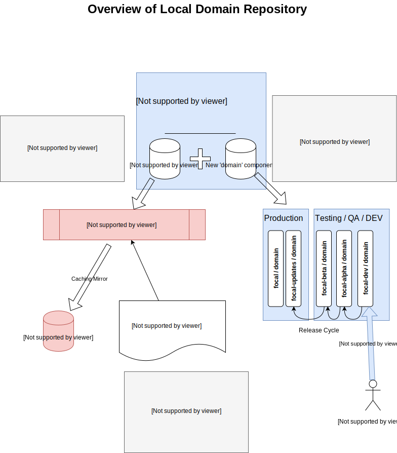

# bg_pkgRepo-dev

This project builds into a deb package which can be installed on a Ubuntu 20.04 host to give it the ability to be a local domain repository server. It depends on the bg-core package.

The local domain repository sets up quickly and since it caches the upstream package files on demand, clients can start using the repository right away and only content actually used by clients will be cached and stored on the repository.

The configuration can specify which channels (aka suites, e.g. focal, focal-updates, etc...), components (e.g. main, universe, etc...), architectures (e.g. amd64,i386), and languages should be available from the local domain repository.

In addition to mirroring a filtered version of the upstream repository, the local domain repository adds the 'domain' component alongside 'main','universe', etc... to contain unique package content to augment the base Ubuntu OS.

The idea of a local domain server is that an organization which controls a set of servers and workstations may want to control the software that those resources have access to. By enforcing that the resources only use the local domain repository instead of public Ubuntu mirrors, the organization can configure the local domain repository to provide only the content that the organization approves.  

## Mirroring

Configure the [pkgRepo] section of the bg-core system wide config system to tailor the repository to your needs. The default for repoServerName is pkgrepo.localhost which works for local testing.
'''
bobg@goodplace:/$ bg-core config view pkgRepo
global     [pkgRepo]repoServerName                  pkgrepo.example.org
global     [pkgRepo]blacklistedPackages             telnet ruby-net-telnet
global     [pkgRepo]channels                        focal focal-security focal-updates
global     [pkgRepo]architectures                   amd64
global     [pkgRepo]components                      main restricted universe multiverse
global     [pkgRepo]languages                       en
global     [pkgRepo]root                            /var/lib/bg-pkgRepo
bobg@goodplace:/$
'''
For example, if it is against your organization's policy to install packages from the multiverse component, remove multiverse from the [pkgRepo]components setting.
'''
bobg@goodplace:/$ bg-core config set -s global pkgRepo components "main restricted"
writing to 'bgsys.global.conf' [sudo]
bobg@goodplace:/$ bg-core config set -s global pkgRepo blacklistedPackages "telnet ruby-net-telnet"
bobg@goodplace:/$
'''

To activate the repository server or to reload it to recognize changes in the config, apply the pkgRepo:on configuration.
'''
bobg@goodplace:/$ bg-configCntr apply pkgRepo:on
Config:pkgRepo:on  : 14/14 100% compliant
bobg@goodplace:/$
'''

## Adding Local Content
Developers and IT Admins submit packages to be included in the repository by copying them to the incoming/ folder. If the package
deb file passes the tests for acceptance, it will be added to the repository in the 'focal-dev' channel, 'domain' component.  The admin
of the repository can then implement a release cycle where the package progresses from focal-dev, to focal-alpha, to focal-beta, and
then eventually to focal or focal-updates (depending on whether the deb file is new or being updated with a newer version).

The idea is that new candidate submissions are gathered in focal-dev. When a release starts, the desired packages are promoted to
focal-alpha and QA test machines that are configured to use focal-alpha will start testing the new release. After sufficient testing
the packages progress to focal-beta which would have a larger set of servers and workstations. There can be as many waterfall steps
as the QA department desires until eventually the packages are made available in the base focal or focal-updates channels where they
are seen by all the servers and workstations in the domain.

## Installation
Eventually I will host a public repository server which will include this package and other bg-* packages.  Until then, you can clone this project, bg-core and bg-dev and follow the instructions in bg-dev to virtually install bg-core and bg-dev. Then you can either virtually install bg-pkgRepo-dev to test it on that machine, or use the bg-dev command to build bg-core and bg-pkgRepo-dev into deb packages.

Here is a quick (and untested) example:
'''
mkdir tempSandbox; cd tempSandbox
git clone git@github.com:junga-com/bg-core.git
git clone git@github.com:junga-com/bg-dev.git
git clone git@github.com:junga-com/bg-pkgRepo-dev.git
source bg-dev/bg-debugCntr
bg-debugCntr vinstall bg-core bg-dev bg-pkgRepo-dev
cd bg-core
bg-dev buildPkg
cd ../bg-pkgRepo-deb
bg-dev buildPkg
'''

## Signing
Since this caching, mirroring, repository changes the content from the upstream, the signature from the upstream source (i.e. ubuntu) is no longer valid.

To get a repository that clients wont complain about, you must install a gpg certificate/key. In the future, we would get that certificate from the organization's bg-domainController but in the mean time, you can follow these instructions to test.

* create a new key pair with gpg. you can specify a passphrase to protect the private key file or not but if you do, each time you run '''bg-pkgRepo update''' you may be prompted for the passphrase in order to complete the operation.
* copy the public key to "${repoRoot}/www/repo-key.asc"

When you change a client's source.list file to use this repository, you must download and install the public key into the client's trusted certificates. 
